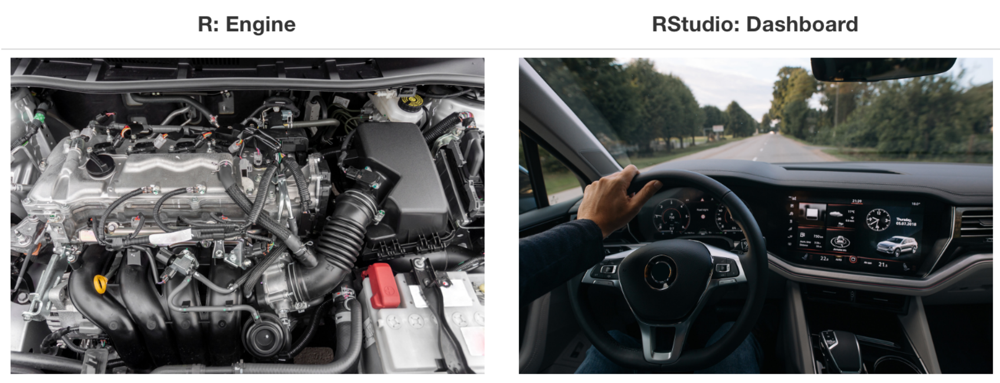
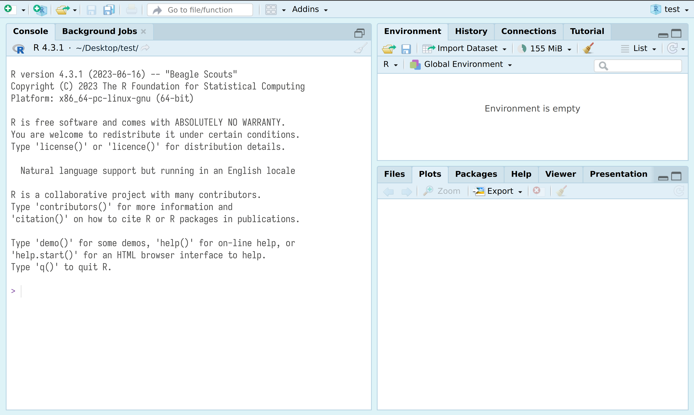
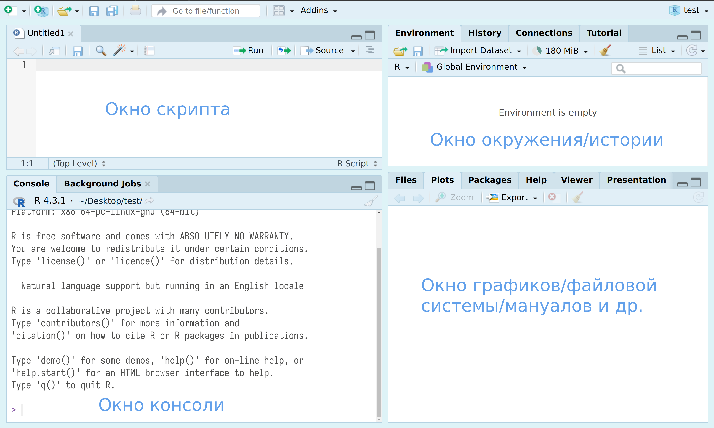

## Введение в R и RStudio

### Некоторые наши проекты с использование `lingtypology`

В Международной лаборатории языковой конвергенции есть [страница с ресурсами](http://lingconlab.ru/).

- [Typological Atlas of the Languages of Daghestan](http://lingconlab.ru/dagatlas/);
- [Atlas of Rutul dialects](https://lingconlab.github.io/rutul_dialectology/);
- [Корпус Просодии Русских Диалектов (ПРуД)](https://lingconlab.github.io/PRuD/);
- [Daghestanian loans database](https://lingconlab.ru/dagloans/).

Все приведенные страницы сделаны на [`quarto`](https://quarto.org/)/`Rmarkdown`, а за карты там отвечает пакет [`lingtypology`](https://ropensci.github.io/lingtypology/) --- надстройка над R-овским пакетом [`leaflet`](https://rstudio.github.io/leaflet/).

### Скачиваем и устанавливаем R. Или нет?

Некоторые люди справедливо не любят устанавливать лишние программы себе на компьютер. Вот несколько вариантов для них:

- [Posit cloud](https://posit.cloud/) --- полная функциональность RStudio с некоторыми неважными для нас ограничениями, нужно залогиниться, например, через google;
- [webR REPL](https://webr.r-wasm.org/latest/) --- ограниченная версия компилятора R, которая работает в вашем браузере и не требует ни установок на компьютер, ни регистрации; `lingtypology` работает и здесь, но почему-то не отображает подложку карт.
- [Jupyter](https://jupyter.org/) ноутбуки;
- [Google Colab](https://colab.research.google.com) (нужно в настройках переключить ядро);
- [VS Code](https://code.visualstudio.com/) --- другое IDE, которое также позволяет работать с R;
- в принципе, в IDE нет нужды, можно работать из терминала, после установки, нужно всего лишь набрать `R`.

Если вам понравилось, R можно установить на собственный компьютер:

- R
    - [на Windows](https://cran.r-project.org/bin/windows/base/)
    - [на Mac](https://cran.r-project.org/bin/macosx/)
    - [на Linux](https://cran.rstudio.com/bin/linux/), также можно установить из командной строки:
    
```
sudo apt-get install r-cran-base
```

- RStudio --- IDE для R ([можно скачать здесь](https://www.rstudio.com/products/rstudio/download/))
- и некоторые пакеты на R

R, RStudio... как-то все путано... Картинка Стефано Каретты:



### Знакомство с RStudio

`RStudio` --- основной IDE для R. После установки R и RStudio можно открыть RStudio и перед вами появится что-то похожее на изображение ниже:


После нажатия на двойное окошко чуть левее надписи *Environment* откроется окно скрипта.



Все следующие команды можно 

- вводить в окне консоли, и тогда для исполнения следует нажимать клавишу `Enter`.
- вводить в окне скрипта, и тогда для исполнения следует нажимать клавиши `Ctrl/Cmd + Enter` или на команду Run на панели окна скрипта. Все, что введено в окне скрипта можно редактировать как в любом текстовом редакторе, в том числе сохранять `Ctrl/Cmd + S`.

Если Вы работаете в <webr.r-wasm.org/>, то в окно консоли код всатвляется при помощи команды `Ctrl/Cmd + Shift + V`, а в окно скрипта ожидаемо `Ctrl/Cmd + V`.

### R как калькулятор

Давайте начнем с самого простого и попробуем использовать R как простой калькулятор. `+`, `-`, `*`, `/`, `^` (степень), `()` и т. д.

```{r}
40+2
3-2
5*6
99/9
2+4*2
(2+4)*2
2^3
```

Обратите внимание на то, что разделителем целой и дробной частей является точка, кроме того, если целая часть состоит исключительно из 0, то ее можно опустить. 

```{r}
50.3 + .7
```

## Разные типы объектов в R

Данные в R обычно причисляют к одному из типов. Сегодня нас будут волновать

- числа
```{r}
42
57.57
```

- строки

```{r}
"Жила-была на свете крыса"
'В морском порту Вальпараисо,'
'На складе мяса и маиса,'
"Какао и вина."
```

- логические 

```{r}
TRUE
FALSE
```

- пропущенные значения

```{r}
NA
```

Объединения значений одного типа в R называют вектор и соединяют их при помощи функции `c()`:

```{r}
c("лъа", "хъу")
c(5, 3, 2)
c(TRUE, FALSE, TRUE)
```

В любом векторе могут быть пропущенные значения:

```{r}
c("лъа", "хъу", NA)
c(5, NA, 3, 2)
c(NA, TRUE, FALSE, TRUE)
```

Табличные данные в R представляют собой наборы векторов и называется датафрейм:

```{r}
data.frame(name = c("Соня", "Лена"),
           hair_length = c(50, 15),
           work_in_academia = c(TRUE, FALSE),
           residence = c("СПб", "Москва"))
```

### Работа с пакетами

Все богатство R находиться в его огромной инфраструктуре пакетов, которые может разрабатывать кто угодно. Для сегодняшнего занятия нам понадобиться всего три: `tidyverse`, `readxl`, `writexl` `lingtypology`. Чтобы их установить нужно использовать команду 

```{r}
#| eval: false

install.packages(c("tidyverse", "readxl", "writexl", "lingtypology"))
```

Помните, что если вы установили пакет, это не значит, что фукнции пакета вам доступны. Пакет еще нужно включить


Проверим, что все установилось.

```{r}
library(lingtypology)
map.feature(c("Nanai", "Guro"))
```

### Чтение и запись табличных данных

Для того, чтобы прочитать данные из `.csv`, `.tsv` и т. п. нужно использовать функции `read_csv()` и `read_tsv()`, где в ковычках путь к файлу или URL.

```{r}
library(tidyverse)
df1 <- read_csv("https://raw.githubusercontent.com/agricolamz/2025.09.27_SPb_lingtypology/main/morning_greetings.csv")
df1
```

Можно также работать с файлами эксель (если Вы [не боитесь](https://www.nature.com/articles/d41586-021-02211-4)), но для этого их надо скачивать локально на компьютер. Попробуйте считать [вот такой файл](https://github.com/agricolamz/2025.09.27_SPb_lingtypology/raw/main/morning_greetings.xlsx).

```{r}
library(readxl)

df2 <- read_xlsx("morning_greetings.xlsx")
df2
```

Запись таблицы происходит при помощи команд `write_csv()`, `write_tsv()` и других. Кроме того есть пакет `writexl` с функцией `write_xlsx()`.

Ссылки на датасеты, если у вас нет своих:

- [morning greetings](https://raw.githubusercontent.com/agricolamz/2025.09.27_SPb_lingtypology/main/morning_greetings.csv) (основан на Naccarato, C. and S. Verhees (2021). “Morning greetings”. In: Typological Atlas of the Languages of Daghestan (TALD). Ed. by M. Daniel, K. Filatov, T. Maisak, G. Moroz, T. Mukhin, C. Naccarato and S. Verhees. Moscow: Linguistic Convergence Laboratory, NRU HSE. DOI: 10.5281/zenodo.6807070. http://lingconlab.ru/dagatlas.)
- [рутульская корова](https://raw.githubusercontent.com/agricolamz/2025.09.27_SPb_lingtypology/main/rutul_lexical_item_for_cowhouse.csv) (основан на моих данных из A. Alekseeva, N. Beklemishev, M. Daniel, N. Dobrushina, K. Filatov, A. Ivanova, T. Maisak, M. Melenchenko, G. Moroz, I. Netkachev, I. Sadakov. Atlas of Rutul dialects. Moscow: Linguistic Convergence Laboratory, HSE University. https://lingconlab.github.io/rutul_dialectology/index.html)

## Знакомство с `lingtypology`

проще продолжить на [сайте-документации](https://ropensci.github.io/lingtypology/).
